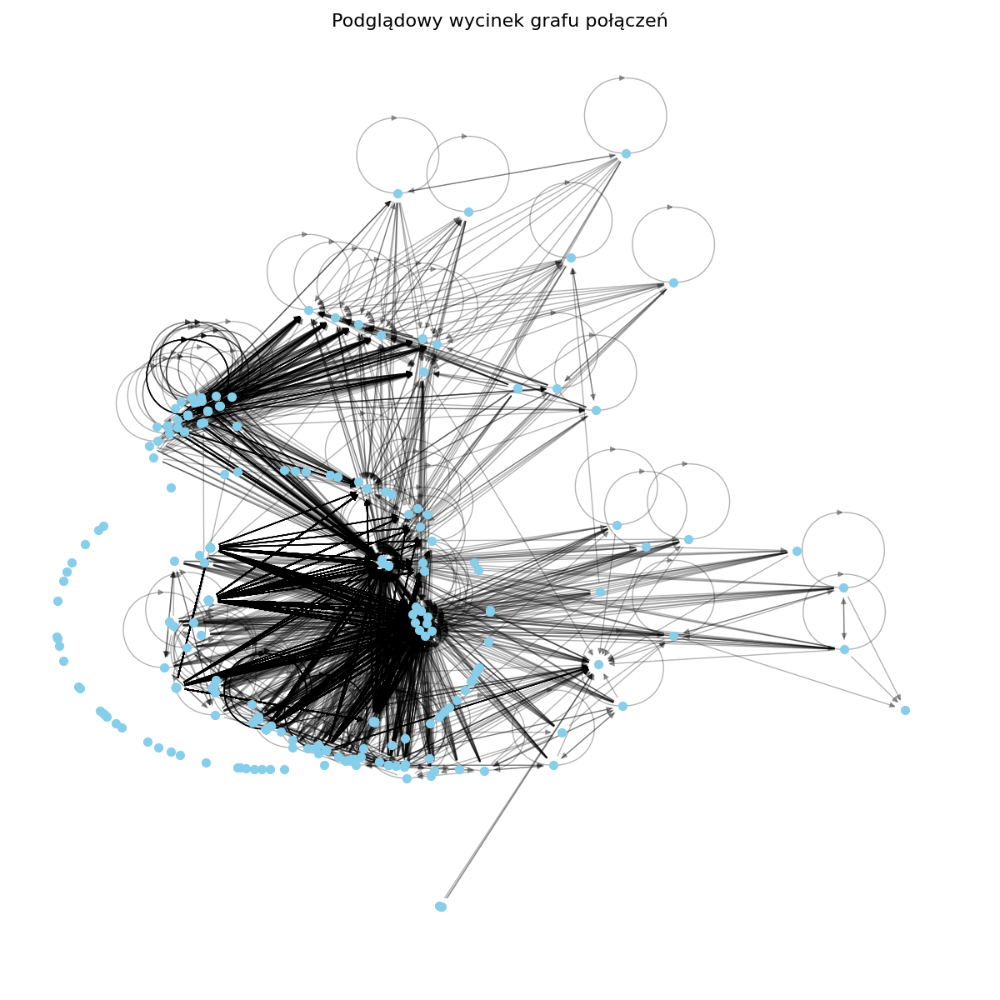
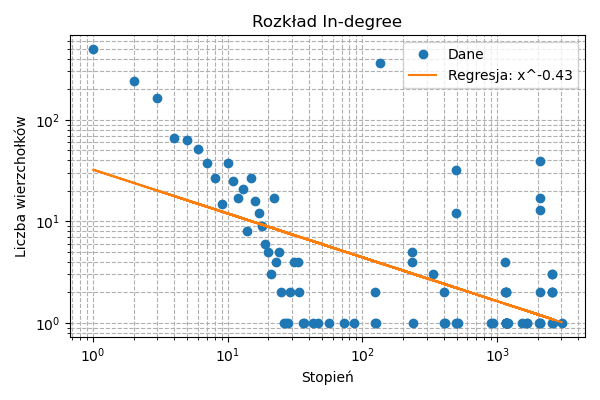
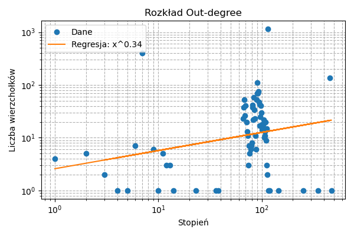
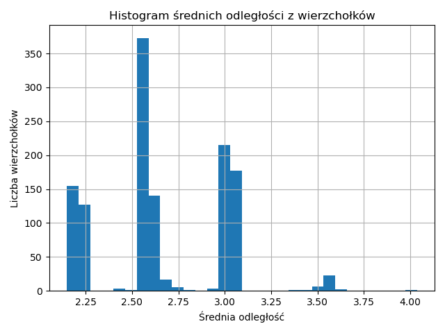
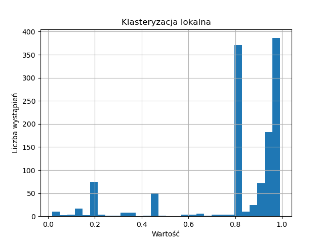

Crawling: 3011it [11:08,  4.50it/s]
Page limit reached, and threads finished. Exiting.
Pobrano graf: 3011 wierzchołków, 309748 krawędzi.

📊 Podstawowe informacje:
 - Wierzchołki: 3011
 - Krawędzie: 309748

🧩 Analiza składowych spójności
 - Liczba słabych składowych spójności (WCC): 1
 - Rozmiar największej WCC: 3011
 - Liczba silnych składowych spójności (SCC): 1677
 - Rozmiar największej SCC: 1251
 - IN (prowadzą do SCC): 1750
 - OUT (osiągalne z SCC): 7
 - TENDRILS / ISLANDS (poza głównym korpusem): 3
 - Wierzchołki w G_SCC (grafie kondensacji): 1677
 - Krawędzie w G_SCC: 8280

📊 Rozkłady stopni (log-log + regresja):
 - In-degree: y = x^-0.43, R² = 0.361

 - Out-degree: y = x^0.34, R² = 0.069

🧭 Analiza najkrótszych ścieżek (dla największej SCC):
 - Średnia odległość (dla SCC): 2.67
 - Średnica (diameter): 7
 - Regresja histogramu (średnie odległości): x^-9.23, R²=0.76

#TODO
🔗 Klasteryzacja:
 - Średni współczynnik klasteryzacji: 0.8119

🛡️ Odporność na awarie i ataki:
 - Symuluję awarię (losowe usunięcie 301 wierzchołków)...
   Po awarii - WCC: 1, SCC: 1514
 - Symuluję atak (usunięcie top 301 wierzchołków o najwyższym stopniu)...
   Po ataku - WCC: 1233, SCC: 2182

🔍 Spójność wierzchołkowa:
 - Graf jest spójny (1-spójny)
 - Punkty artykulacji: 2

