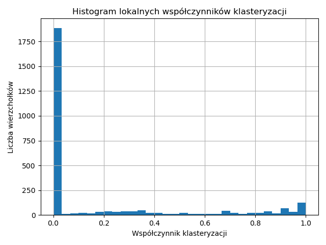
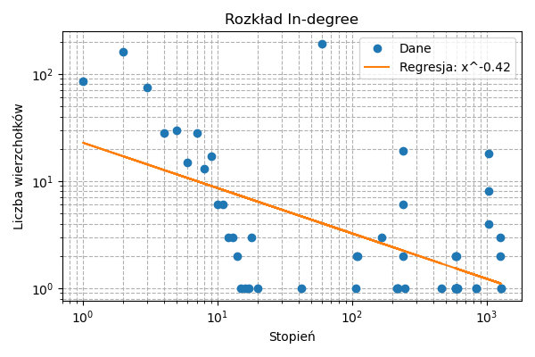

Crawling: 3011it [11:08,  4.50it/s]
Page limit reached, and threads finished. Exiting.
Pobrano graf: 3011 wierzchołków, 309748 krawędzi.

📊 Podstawowe informacje:
 - Wierzchołki: 3011
 - Krawędzie: 309748

🧩 Analiza składowych spójności
 - Liczba słabych składowych spójności (WCC): 1
 - Rozmiar największej WCC: 3011
 - Liczba silnych składowych spójności (SCC): 1677
 - Rozmiar największej SCC: 1251
 - IN (prowadzą do SCC): 1750
 - OUT (osiągalne z SCC): 7
 - TENDRILS / ISLANDS (poza głównym korpusem): 3
 - Wierzchołki w G_SCC (grafie kondensacji): 1677
 - Krawędzie w G_SCC: 8280

📊 Rozkłady stopni (log-log + regresja):
 - In-degree: y = x^-0.43, R² = 0.361

 - Out-degree: y = x^0.34, R² = 0.069

🧭 Analiza najkrótszych ścieżek (dla największej SCC):
 - Średnia odległość (dla SCC): 2.67
 - Średnica (diameter): 7
 - Regresja histogramu (średnie odległości): x^-9.23, R²=0.76

🔗 Współczynniki klasteryzacji:
 - Globalna klasteryzacja: 0.6949
 - Liczba wierzchołków z C > 0: 3008
 - Regresja histogramu klasteryzacji: x^0.37, R²=0.03

🧩 Spójność wierzchołkowa:
 - Spójność wierzchołkowa: 1
 - Szukanie wierzchołków rozspajających (punkty artykulacji)...
   Znaleziono 2 punktów artykulacji.
   Przykład: ['https://www.um.edu.mt/research/ethics/researchethicsatum/', 'https://www.um.edu.mt/']

# Awaria - usunięcie 10% losowych stron

Pobrano graf: 2710 wierzchołków, 253956 krawędzi.

🧩 Analiza składowych spójności
 - Liczba słabych składowych spójności (WCC): 1
 - Rozmiar największej WCC: 2710
 - Liczba silnych składowych spójności (SCC): 1504
 - Rozmiar największej SCC: 1133
 - IN (prowadzą do SCC): 1571
 - OUT (osiągalne z SCC): 5
 - TENDRILS / ISLANDS (poza głównym korpusem): 1
 - Wierzchołki w G_SCC (grafie kondensacji): 1504
 - Krawędzie w G_SCC: 5745

📊 Rozkłady stopni (log-log + regresja):
 - In-degree: y = x^-0.43, R² = 0.344

 - Out-degree: y = x^0.37, R² = 0.076

🧭 Analiza najkrótszych ścieżek (dla największej SCC):
 - Średnia odległość (dla SCC): 2.67
 - Średnica (diameter): 7
 - Regresja histogramu (średnie odległości): x^-1.67, R²=1.00

🔗 Współczynniki klasteryzacji:
 - Globalna klasteryzacja: 0.6970
 - Liczba wierzchołków z C > 0: 2709
 - Regresja histogramu klasteryzacji: x^0.29, R²=0.02

🧩 Spójność wierzchołkowa:
 - Spójność wierzchołkowa: 1
 - Szukanie wierzchołków rozspajających (punkty artykulacji)...
   Znaleziono 1 punktów artykulacji.
   Przykład: ['https://www.um.edu.mt/']

# Atak - usunięcie 10% stron o najwyższym stopniu
Pobrano graf: 2710 wierzchołków, 10090 krawędzi.

🧩 Analiza składowych spójności
 - Liczba słabych składowych spójności (WCC): 1233
 - Rozmiar największej WCC: 1075
 - Liczba silnych składowych spójności (SCC): 2182
 - Rozmiar największej SCC: 397
 - IN (prowadzą do SCC): 573
 - OUT (osiągalne z SCC): 39
 - TENDRILS / ISLANDS (poza głównym korpusem): 1701
 - Wierzchołki w G_SCC (grafie kondensacji): 2182
 - Krawędzie w G_SCC: 2249

📊 Rozkłady stopni (log-log + regresja):
 - In-degree: y = x^-1.04, R² = 0.633

 - Out-degree: y = x^-0.93, R² = 0.509

🧭 Analiza najkrótszych ścieżek (dla największej SCC):
 - Średnia odległość (dla SCC): 5.88
 - Średnica (diameter): 18
 - Regresja histogramu (średnie odległości): x^-3.48, R²=0.28

🔗 Współczynniki klasteryzacji:
 - Globalna klasteryzacja: 0.1790
 - Liczba wierzchołków z C > 0: 853
 - Regresja histogramu klasteryzacji: x^0.04, R²=0.00

🧩 Spójność wierzchołkowa:
 - Graf niespójny → brak sensu szukać rozspajających wierzchołków.

# Awaria - usunięcie 30% losowych wierzchołków

Pobrano graf: 2108 wierzchołków, 159559 krawędzi.

🧩 Analiza składowych spójności
 - Liczba słabych składowych spójności (WCC): 1
 - Rozmiar największej WCC: 2108
 - Liczba silnych składowych spójności (SCC): 1472
 - Rozmiar największej SCC: 574
 - IN (prowadzą do SCC): 1525
 - OUT (osiągalne z SCC): 6
 - TENDRILS / ISLANDS (poza głównym korpusem): 3
 - Wierzchołki w G_SCC (grafie kondensacji): 1472
 - Krawędzie w G_SCC: 31637

📊 Rozkłady stopni (log-log + regresja):
 - In-degree: y = x^-0.39, R² = 0.297

 - Out-degree: y = x^0.26, R² = 0.037

🧭 Analiza najkrótszych ścieżek (dla największej SCC):
 - Średnia odległość (dla SCC): 2.63
 - Średnica (diameter): 9
 - Regresja histogramu (średnie odległości): x^-7.62, R²=1.00

🔗 Współczynniki klasteryzacji:
 - Globalna klasteryzacja: 0.7210
 - Liczba wierzchołków z C > 0: 2105
 - Regresja histogramu klasteryzacji: x^0.54, R²=0.07

🧩 Spójność wierzchołkowa:
 - Spójność wierzchołkowa: 1
 - Szukanie wierzchołków rozspajających (punkty artykulacji)...
   Znaleziono 2 punktów artykulacji.
   Przykład: ['https://www.um.edu.mt/research/ethics/researchethicsatum/', 'https://www.um.edu.mt/']

# Atak - usunięcie 30% stron o najwyższym stopniu
Pobrano graf: 2108 wierzchołków, 3014 krawędzi.

🧩 Analiza składowych spójności
 - Liczba słabych składowych spójności (WCC): 1274
 - Rozmiar największej WCC: 689
 - Liczba silnych składowych spójności (SCC): 1878
 - Rozmiar największej SCC: 85
 - IN (prowadzą do SCC): 362
 - OUT (osiągalne z SCC): 16
 - TENDRILS / ISLANDS (poza głównym korpusem): 1645
 - Wierzchołki w G_SCC (grafie kondensacji): 1878
 - Krawędzie w G_SCC: 1148

📊 Rozkłady stopni (log-log + regresja):
 - In-degree: y = x^-1.73, R² = 0.857

 - Out-degree: y = x^-2.24, R² = 0.771

🧭 Analiza najkrótszych ścieżek (dla największej SCC):
 - Średnia odległość (dla SCC): 5.26
 - Średnica (diameter): 17
 - Regresja histogramu (średnie odległości): x^-2.63, R²=0.54

🔗 Współczynniki klasteryzacji:
 - Globalna klasteryzacja: 0.1757
 - Liczba wierzchołków z C > 0: 614
 - Regresja histogramu klasteryzacji: x^-0.32, R²=0.06

🧩 Spójność wierzchołkowa:
 - Graf niespójny → brak sensu szukać rozspajających wierzchołków.
 - 
# Awaria - usunięcie 50% losowych wierzchołków

Pobrano graf: 1506 wierzchołków, 72649 krawędzi.

🧩 Analiza składowych spójności
 - Liczba słabych składowych spójności (WCC): 2
 - Rozmiar największej WCC: 1505
 - Liczba silnych składowych spójności (SCC): 886
 - Rozmiar największej SCC: 573
 - IN (prowadzą do SCC): 929
 - OUT (osiągalne z SCC): 3
 - TENDRILS / ISLANDS (poza głównym korpusem): 1
 - Wierzchołki w G_SCC (grafie kondensacji): 886
 - Krawędzie w G_SCC: 1815

📊 Rozkłady stopni (log-log + regresja):
 - In-degree: y = x^-0.42, R² = 0.355

 - Out-degree: y = x^0.40, R² = 0.076

🧭 Analiza najkrótszych ścieżek (dla największej SCC):
 - Średnia odległość (dla SCC): 2.73
 - Średnica (diameter): 6
 - Regresja histogramu (średnie odległości): x^-6.53, R²=0.75

🔗 Współczynniki klasteryzacji:
 - Globalna klasteryzacja: 0.6195
 - Liczba wierzchołków z C > 0: 1296
 - Regresja histogramu klasteryzacji: x^0.32, R²=0.02

🧩 Spójność wierzchołkowa:
 - Graf niespójny → brak sensu szukać rozspajających wierzchołków.

# Atak - usunięcie 50% stron o najwyższym stopniu

Pobrano graf: 1506 wierzchołków, 3014 krawędzi.

🧩 Analiza składowych spójności
 - Liczba słabych składowych spójności (WCC): 672
 - Rozmiar największej WCC: 689
 - Liczba silnych składowych spójności (SCC): 1276
 - Rozmiar największej SCC: 85
 - IN (prowadzą do SCC): 362
 - OUT (osiągalne z SCC): 16
 - TENDRILS / ISLANDS (poza głównym korpusem): 1043
 - Wierzchołki w G_SCC (grafie kondensacji): 1276
 - Krawędzie w G_SCC: 1148

📊 Rozkłady stopni (log-log + regresja):
 - In-degree: y = x^-1.73, R² = 0.857

 - Out-degree: y = x^-2.24, R² = 0.771

🧭 Analiza najkrótszych ścieżek (dla największej SCC):
 - Średnia odległość (dla SCC): 5.26
 - Średnica (diameter): 17
 - Regresja histogramu (średnie odległości): x^-2.63, R²=0.54

🔗 Współczynniki klasteryzacji:
 - Globalna klasteryzacja: 0.2460
 - Liczba wierzchołków z C > 0: 614
 - Regresja histogramu klasteryzacji: x^-0.32, R²=0.06

🧩 Spójność wierzchołkowa:
 - Graf niespójny → brak sensu szukać rozspajających wierzchołków.

# Pagerank

 - Regresja log-log: y ~ x^-1.67, R² = 0.868

 - Regresja log-log: y ~ x^-0.83, R² = 0.746

🔁 Zbieżność PageRank dla różnych współczynników tłumienia:

Damping = 0.6

Top 5 stron:
  - https://www.um.edu.mt/... : 4.4070e-02
  - https://www.um.edu.mt... : 9.3791e-03
  - http://www.um.edu.mt/privacy... : 9.1012e-03
  - https://www.um.edu.mt/privacy/... : 6.6171e-03
  - https://www.um.edu.mt/itservices/help... : 6.3405e-03

 - Regresja log-log: y ~ x^-0.58, R² = 0.667
 - 

Damping = 0.75

Top 5 stron:
  - https://www.um.edu.mt/... : 8.2374e-02
  - https://www.um.edu.mt... : 1.0303e-02
  - http://www.um.edu.mt/privacy... : 1.0017e-02
  - https://www.um.edu.mt/privacy/... : 8.3972e-03
  - https://www.um.edu.mt/research/... : 7.1122e-03

 - Regresja log-log: y ~ x^-0.71, R² = 0.707

Damping = 0.85

Top 5 stron:
 - https://www.um.edu.mt/... : 1.4197e-01
 - https://www.um.edu.mt... : 1.0329e-02
 - http://www.um.edu.mt/privacy... : 1.0060e-02
 - https://www.um.edu.mt/privacy/... : 9.2597e-03
 - https://www.um.edu.mt/students/... : 7.4796e-03

 - Regresja log-log: y ~ x^-0.83, R² = 0.746

Damping = 0.95

Top 5 stron:
  - https://www.um.edu.mt/... : 3.4959e-01
  - https://www.um.edu.mt... : 8.3158e-03
  - https://www.um.edu.mt/privacy/... : 8.1784e-03
  - http://www.um.edu.mt/privacy... : 8.1160e-03
  - https://www.um.edu.mt/research/... : 6.2385e-03

 - Regresja log-log: y ~ x^-1.04, R² = 0.799

Damping = 1.0

Top 5 stron:
 - https://www.um.edu.mt/... : 9.3913e-01
 - https://www.um.edu.mt/privacy/... : 8.5723e-04
 - https://www.um.edu.mt... : 8.1371e-04
 - http://www.um.edu.mt/privacy... : 7.9557e-04
 - https://www.um.edu.mt/students/... : 6.1945e-04

 - Regresja log-log: y ~ x^-1.67, R² = 0.868

